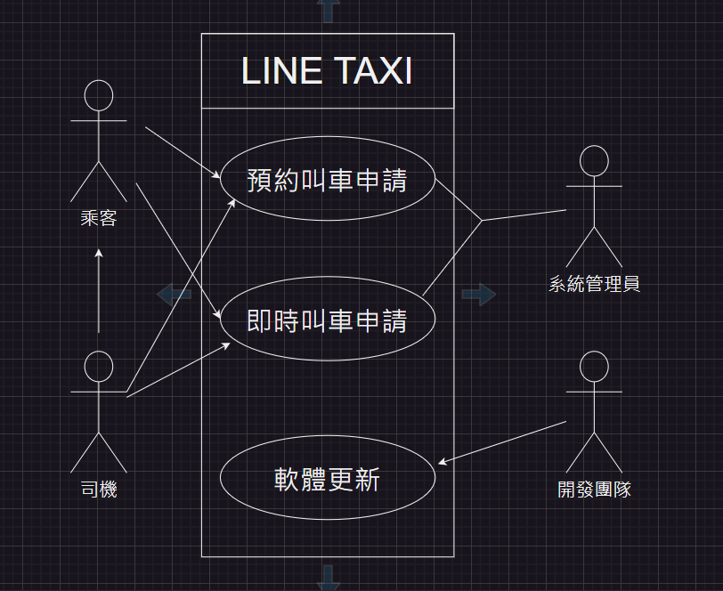
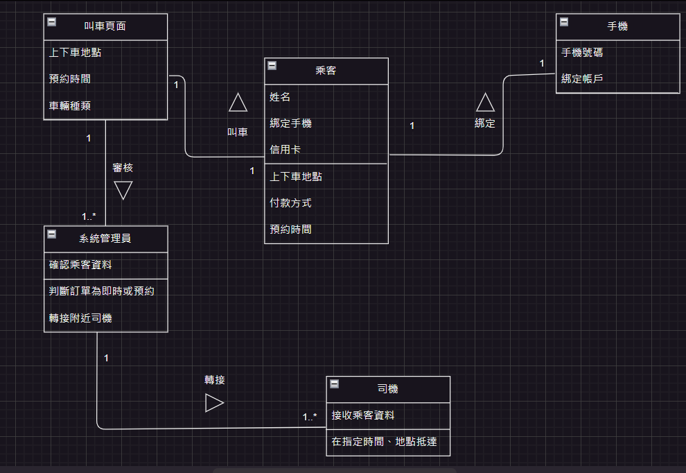

>學號：111104105 111108116
> 
>姓名：陳郁升 吳亭誼
> 

1. LINE TAXI 背景分析如下
 
整體APP分成前台和後台。前台主要為給乘客及計程車司機進行，後台則給予系統進行審核、應安排最近距離的司機。假設乘客為預約叫車，在前台的整體流程中，乘客須在叫車前於預約時間前 30 分鐘進行申請。申請方式為打開 LINE 後，加入LINE TAXI帳號。進入APP後，需先進行身分驗證，再使用手機號碼進行註冊，在選單中先選擇需要的預約時段，再輸入上下車地址後選擇叫車的車種。當上述內容撰寫完畢需綁定付款方式，送出後系統依乘客選擇時段、地址安排司機，乘客等待司機後抵達即完成叫車。若假設人員為即時叫車人員，其主要流程與預約叫車類似，唯一不同在於即時叫車人員在進入選單後，無須點選叫車時段，即可進行叫車，剩下的步驟直至將該申請進入後台給系統進行審核流程一致。
  
利害關係人表
| 利害人 | 目標 |  
|---|---|
乘客|1.簡單的叫車流程。 2.安全的交通工具。 3.準時接送服務。 4.多樣的付款方式。 
計程車司機|1.增加收入來源。 2.預約安排工作時間，提高效率。 3.減少空車時間。 
系統管理員|1.確保系統運行順暢。 2.確保乘客和司機的個資安全。 3.準確處理和審核乘客的訂單申請。 
LINE TAXI開發團隊|1.確保應用程式功能全面，符合市場需求。 2.持續改進和優化用戶體驗。 3.透過用戶回饋提升服務品質。 

事件表

|案例名稱|事件描述|
|----|----|
預約叫車申請  |	乘客填寫申請後，系統審核通過，安排司機，並將乘車資料、預約時間推送給司機載客。
即時叫車申請  |	乘客填寫申請後，系統審核通過，安排司機，並將乘車資料推送給司機載客。
軟體更新  |	軟體隨著的市場需求而改變，包括安全性、系統便利性，通知開發團隊進行相應的更新。          
註冊綁定  |   進入APP後，進行手機號碼註冊驗證，收取簡訊驗證碼綁定帳戶。
綁定付款方式  |   進入APP後，設定信用卡或LINE PAY等付款帳戶。

系統使用案例圖 

 

使用案例  
1.
 
|||
|----|----|
|**使用者案例名稱**|預約叫車申請|
|**使用者案例描述** |乘客須提前30分鐘輸入上下車地址、時段等，系統審核後司機再依指示進行載客。|
| **主要參與者**|乘客、司機、系統管理員|    
|**利害關係人與目標** |乘客：簡單的叫車流程 司機：預約安排工作時間，提高效率。 系統管理員：準確處理和審核乘客的訂單申請。|   
|**前置條件** |乘客需打開APP，並進入叫車頁面點選相應的資料。|
|**後置條件** |乘客成功搭乘計程車|  
|**主要成功情節** |1.乘客先打開APP，進入叫車頁面 2.輸入指定時段及地址後，確認付款 3.系統審核後，司機依指定時段及地址抵達 4.乘客搭乘成功|   
 
2.
 

|||
|---|---|
|**使用者案例名稱**|即時叫車申請|
|**使用者案例描述** |乘客在叫車頁面輸入上下車地址，系統審核後司機再依指示進行載客。|
| **主要參與者**|乘客、司機、系統管理員|    
|**利害關係人與目標**| 乘客：簡單的叫車流程 司機：預約安排工作時間，提高效率。 系統管理員：準確處理和審核乘客的訂單申請。|   
|**前置條件** |乘客需打開APP，並進入叫車頁面點選相應的資料。|
|**後置條件** |乘客成功搭乘計程車|  
|**主要成功情節** |1.乘客先打開APP，進入叫車頁面 2.輸入上下車地址後，確認付款 3.系統審核後，司機依指定地址抵達 4.乘客搭乘成功|   
 

3.
 

|||
|---|---|
|**使用者案例名稱**|綁定註冊|
|**使用者案例描述** |乘客有搭乘計程車需求，打開LINE TAXI進行使用|
| **主要參與者**|乘客|    
|**利害關係人與目標** |乘客：成功搭乘計程車 |   
|**前置條件** |乘客需打開APP，先進行身分驗證，再使用手機號碼進行註冊|
|**後置條件** |註冊成功|  
|**主要成功情節** |1.乘客需打開APP 2.進行身分驗證 3.使用手機號碼獲取簡訊驗證碼 4.註冊成功|   
 
   
 
初步類別圖 

